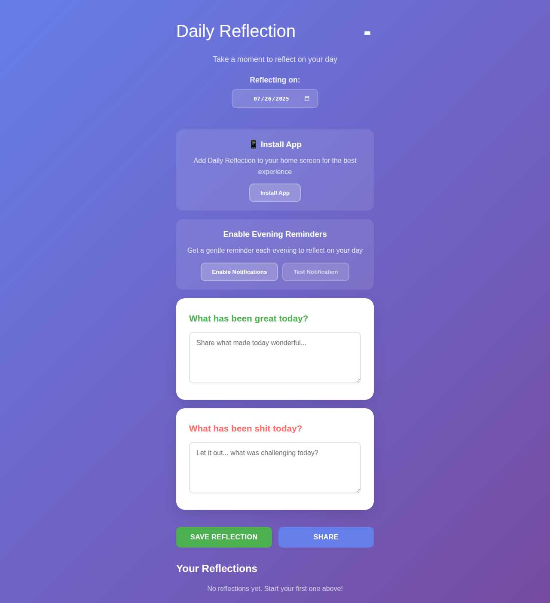

# Daily Reflection

A simple Progressive Web App for daily journaling and self-reflection.



## Features

- **Daily prompts**: Reflect on what went well and what was challenging
- **Works offline**: Install as a PWA for native app experience
- **Auto-save**: Never lose your thoughts
- **History**: View, edit, and delete past reflections
- **Backup**: Export/import your data
- **Mobile-friendly**: Touch gestures and responsive design

## Quick Start

### Use the App
1. Open in your web browser
2. Install as PWA when prompted (optional)
3. Start reflecting!

### Local Development
```bash
git clone https://github.com/herrbenesch/daily-reflection.git
cd daily-reflection

# Serve with any static server
python3 -m http.server 8080
# or
npx serve .
```

Open http://localhost:8080 in your browser.

## How to Use

1. **Write reflections**: Answer "What has been great today?" and "What has been challenging today?"
2. **Navigate dates**: Use the date picker to reflect on any day
3. **Manage history**: View past reflections below the form
4. **Backup data**: Use the menu (☰) to export/import your reflections

## Technical Details

**Built with:** Vanilla HTML, CSS, JavaScript  
**Storage:** Browser LocalStorage  
**PWA:** Service Worker + Web App Manifest

### File Structure
```
├── index.html      # Main app
├── backup.html     # Backup management
├── app.js          # Core logic
├── style.css       # Styling
├── sw.js           # Service Worker
├── manifest.json   # PWA manifest
└── icons/          # App icons
```

### Data Format
Reflections are stored as:
```javascript
{
  date: "2025-07-26T00:00:00.000Z",
  great: "Positive reflection text",
  shit: "Challenge reflection text",
  autoSaved: false
}
```

## Contributing

1. Fork and clone the repository
2. Make your changes
3. Test on mobile and desktop
4. Submit a pull request

Keep changes simple and focused on the core reflection experience.

## License

Apache License 2.0
